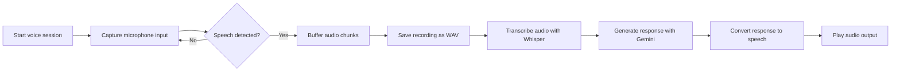

# VoiceFlow

VoiceFlow is a real-time voice assistant project that turns microphone input into transcribed speech, AI-generated responses, and spoken output. The project is still in its early stages, but it already demonstrates a working voice-to-text-to-response pipeline.

## What I’ve done so far
- Built a microphone capture loop using PyAudio
- Added basic speech activity detection with PyTorch-based audio-level analysis
- Buffered spoken audio and saved it as a WAV file
- Transcribed recorded audio using Groq Whisper
- Sent the transcription to Gemini for AI response generation
- Played the generated response back through speech output
- Documented the interaction flow with a Mermaid diagram

## Visual workflow



## Tech stack
- Python 3.9+
- PyAudio for live microphone input
- PyTorch for basic audio analysis
- Groq SDK for speech-to-text transcription
- Google GenAI SDK for conversational responses
- python-dotenv for environment configuration
- Mermaid for workflow documentation

## How to clone the repository

```bash
git clone https://github.com/Dreamervamsi/VoiceFlow.git
cd VoiceFlow
```

## How to run it

1. Create and activate a virtual environment:
   ```bash
   python3 -m venv .venv
   source .venv/bin/activate
   ```

2. Install the dependencies:
   ```bash
   pip install -r requirements.txt
   ```

   You can also install it as a package with:
   ```bash
   pip install -e .
   ```

3. Set up your environment variables:
   ```bash
   export GROQ_API_KEY="your_groq_api_key"
   export GEMINI_API_KEY="your_gemini_api_key"
   ```

4. Run the application:
   ```bash
   python voice.py
   ```

## Project roadmap

I’m planning to take this project further by adding:
- A neat and polished UI for a better user experience
- A database for storing conversations, transcripts, and analysis data
- Better conversation history and analytics features
- Improved reliability for voice interaction and audio processing

## Project files
- requirements.txt: dependency list for quick setup
- pyproject.toml: Python packaging configuration
- voice.py: main voice assistant script
