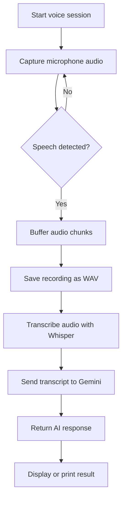

# VoiceFlow

VoiceFlow is a real-time voice assistant that captures microphone input, detects speech activity, transcribes audio, and generates AI responses. I’ve started building the experience around a simple voice-to-text-to-response pipeline and documented the flow using Mermaid so the logic is easy to follow.

## What I’ve done so far
- Built a microphone capture loop with PyAudio
- Added basic speech activity detection using PyTorch
- Implemented audio recording and WAV export
- Integrated speech transcription with Groq Whisper
- Connected the transcribed text to an LLM chat response using Gemini
- Started documenting the interaction flow with Mermaid diagrams

## Interactive flowchart



## Tech stack so far
- Python
- PyAudio for microphone input
- PyTorch for basic audio-level analysis
- Groq SDK for Whisper transcription
- Google GenAI SDK for Gemini chat responses
- python-dotenv for environment management
- Mermaid for flowchart documentation

## How to clone and run it

1. Clone the repository:
   ```bash
   git clone https://github.com/Dreamervamsi/VoiceFlow.git
   cd VoiceFlow
   ```

2. Create and activate a virtual environment:
   ```bash
   python3 -m venv .venv
   source .venv/bin/activate
   ```

3. Install the project dependencies:
   ```bash
   pip install -r requirements.txt
   ```

   You can also install it as a Python package with:
   ```bash
   pip install -e .
   ```

4. Set up your environment variables:
   ```bash
   export GROQ_API_KEY="your_groq_api_key"
   export GEMINI_API_KEY="your_gemini_api_key"
   ```

5. Run the application:
   ```bash
   python voice.py
   ```

## Project files
- requirements.txt: dependency list for quick setup
- pyproject.toml: modern Python packaging configuration
- voice.py: main voice assistant script
